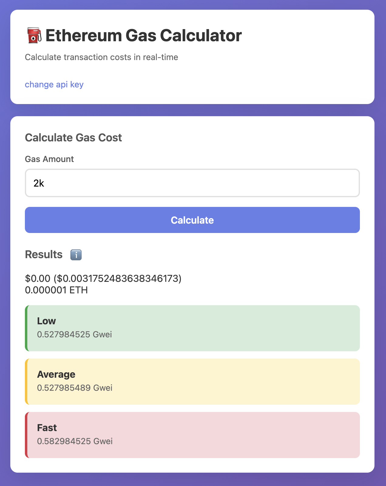

# Local Ethereum Gas Calculator based on Etherscan API

  

- A simple, local, single-file HTML calculator for estimating Ethereum transaction costs in real-time.
- Store as bookmark for simple use.
- Supply etherscan API key once, stored locally too!

## Usage

1. Open `gas_cost.html` in your browser
2. Enter your Etherscan API key (get one free at [etherscan.io](https://etherscan.io/apis))
3. Enter the gas amount for your transaction
4. Click Calculate

## Requirements

- Browser
- Etherscan API key (free)
- Internet connection for API calls
